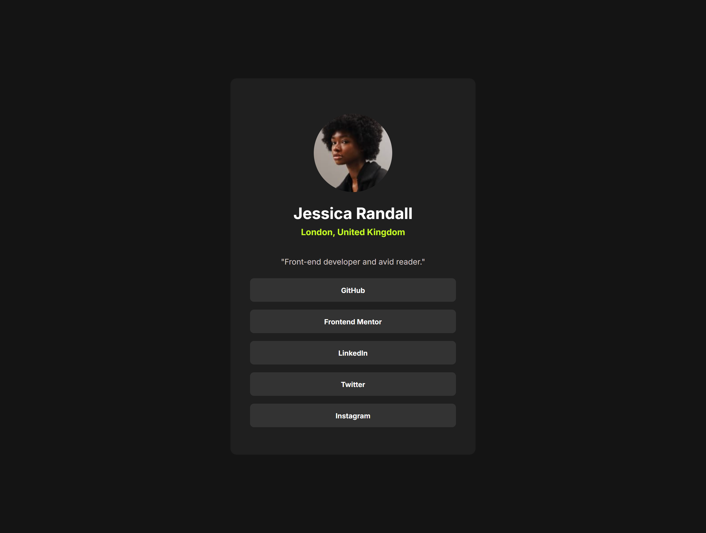
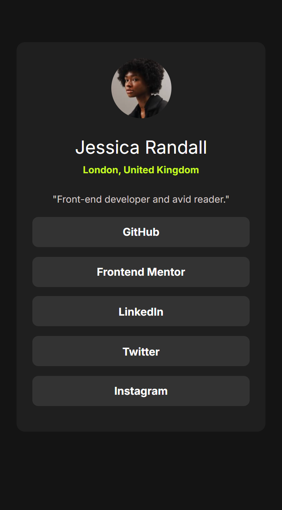

# Frontend Mentor - Social links profile

This is my solution to the [Social links profile challenge](https://www.frontendmentor.io/challenges/social-links-profile-UG32l9m6dQ) on Frontend Mentor. It's a responsive profile card that includes hover and focus states for social links.

## 🔗 Live Demo

- 🌐 [Live Site](https://Fabiha517.github.io/social-links-profile/)
- 🛠️ [Solution Code](https://github.com/Fabiha517/social-links-profile)

## 📸 Screenshot

desktop: 
mobile: 
## 🛠️ Built With

- HTML5
- CSS3 (custom properties + media queries)
- Flexbox
- Mobile-first workflow
- Responsive units like `clamp()` and `vh`

## 💡 What I Learned

- Creating responsive layouts using `max-width`, `min-height`, and `clamp()`
- Managing screen sizes like iPad Pro and Nest Hub Max with specific media queries
- Using `::before`/`::after` and `box-sizing: inherit` for layout consistency
- Improving accessibility with focus/hover states

## 🚀 Future Improvements

- Add smooth transitions between breakpoints
- Consider using a CSS framework or utility classes for scaling

## 👩‍💻 Author

- GitHub: [@Fabiha517](https://github.com/Fabiha517)
- Frontend Mentor: [@Fabiha517](https://www.frontendmentor.io/profile/Fabiha517)

